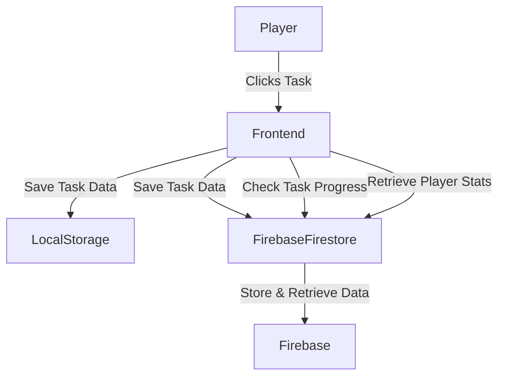
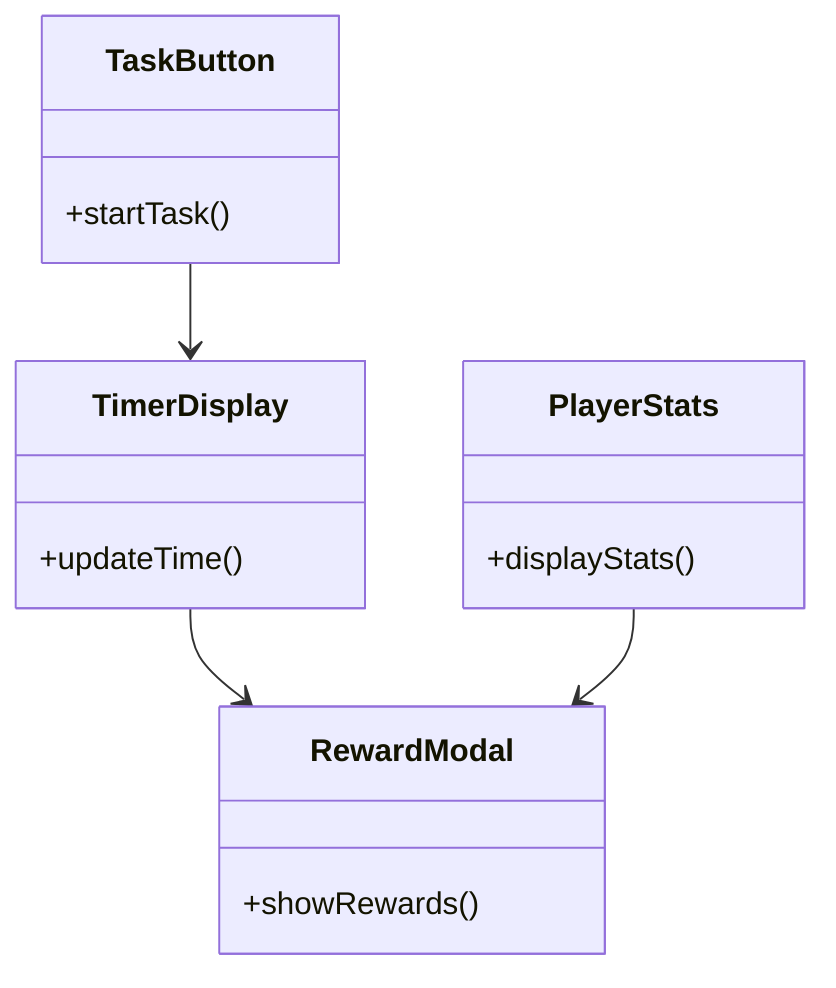
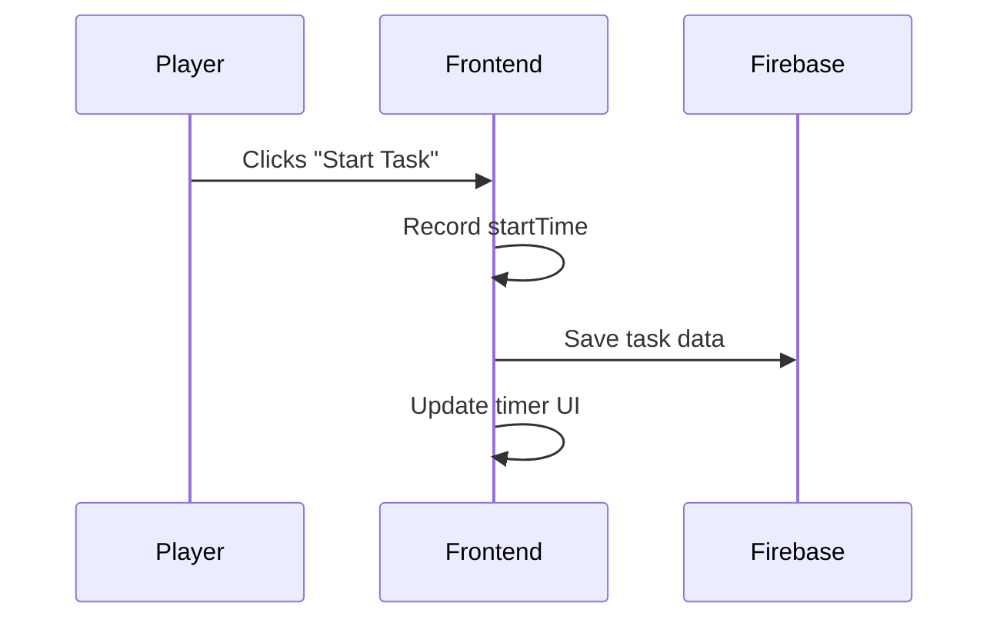
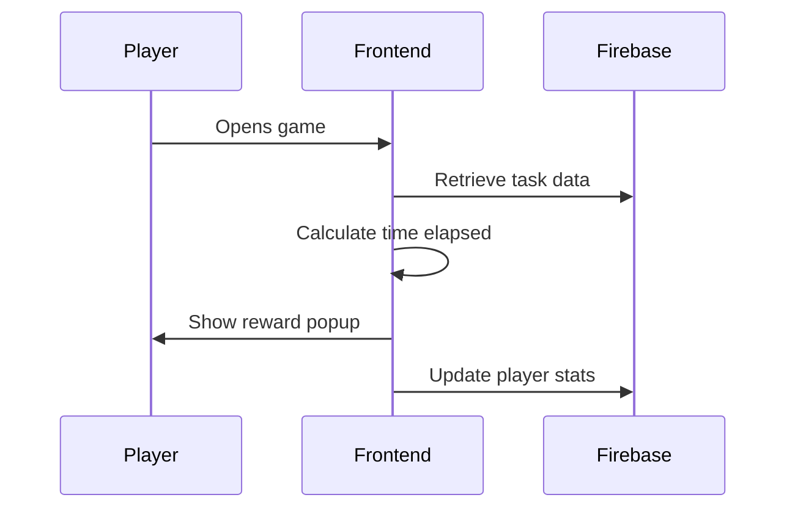
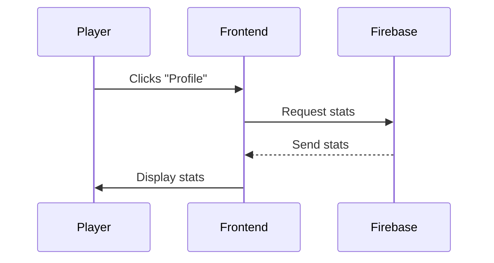

# Phaser Game Technical Plan

## 0. User Stories and Mockups

### User Stories (Prioritized with MoSCoW):

#### Must Have:
- As a player, I want to start a work task (e.g., Lumberjack), so that I can earn experience and loot.
- As a player, I want my progress to be saved even if I close the game, so that I can resume where I left off.
- As a player, I want to receive feedback when a task is completed, so that I know when to claim my rewards.

#### Should Have:
- As a player, I want to view my character's stats and level, so that I can track my progress.
- As a player, I want a visual timer for tasks, so that I can see how much time remains.

#### Could Have:
- As a player, I want to choose the duration of a task for variable rewards.
- As a player, I want sound effects or simple animations to enhance feedback.

#### Won't Have (for MVP):
- Multiplayer interaction.
- Complex animations or real-time combat.

### Mockups:
- Main screen with buttons for work actions.
- Timer display UI.
- Rewards modal popup.
- Character profile page with stats.

---

## 1. System Architecture

### High-Level Components:
- **Frontend:** Phaser (rendering UI and gameplay logic)
- **Backend:** Firebase (Firestore for data, Auth for login, Functions for timers if needed)
- **Database:** Firebase Firestore (document-based)
- **Storage:** LocalStorage (initial prototype)

### Data Flow:
- Player starts a task on the frontend.
- Task start time is saved to localStorage or Firebase.
- On return, frontend calculates or requests elapsed time.
- If task completed, reward logic is triggered and saved.

### Architecture Diagram (Mermaid)

---

## 2. Components, Classes, and Database Design

### Front-End Components:
- `TaskButton` – triggers a work action
- `TimerDisplay` – shows remaining time
- `RewardModal` – displays rewards
- `PlayerStats` – shows level, XP, and loot

### Firebase Document Structure:
**Collection:** `users`  
**Document fields:**
- `uid` (string)
- `currentTask`: {
  `type`: "lumberjack",
  `startTime`: timestamp,
  `duration`: milliseconds
}
- `xp`: number
- `level`: number
- `inventory`: array of items

### Component Diagram (Mermaid)

---

## 3. Sequence Diagrams

### Use Case 1: Start a Task

### Use Case 2: Return and Claim Rewards

### Use Case 3: View Stats

---

## 4. External and Internal APIs

### External APIs:
- Firebase Authentication (for user login)
- Firebase Firestore (for data persistence)

### Internal API (via Firebase Functions or REST):
- `POST /start-task` – start a new task  
  **Input:** `{ uid, taskType, startTime, duration }`  
  **Output:** `200 OK`

- `GET /task-status` – check if task completed  
  **Input:** `uid`  
  **Output:** `{ status: 'completed' | 'in_progress', timeLeft: ms }`

- `POST /claim-reward` – finalize reward and update stats  
  **Input:** `{ uid, taskType }`  
  **Output:** `{ xpGained, items }`

---

## 5. SCM and QA Strategy

### SCM (Source Control):
- Git with GitHub repository
- Branching strategy:
  - `main`: production-ready code
  - `dev`: active development
  - `feature/*`: isolated features (e.g., feature/lumberjack-task)
- Pull Requests and code reviews before merging

### QA (Quality Assurance):
- Unit tests for timer logic and reward calculation (Jest)
- Manual testing for UI and interactions
- Optional: automated UI testing with Playwright or Cypress
- Deployment: GitHub Actions for CI/CD to staging environment (e.g., Firebase Hosting or Vercel)

---

## 6. Final Deliverable: Technical Documentation

This document includes:
- ✅ User Stories & Mockups
- ✅ System Architecture Diagram (Mermaid)
- ✅ Component/Class & Database Design (Mermaid)
- ✅ Sequence Diagrams for major flows (Mermaid)
- ✅ Internal & External API Documentation
- ✅ SCM and QA Plans
- ✅ Justifications: Phaser chosen for interactive UI, Firebase for scalable backend and built-in auth